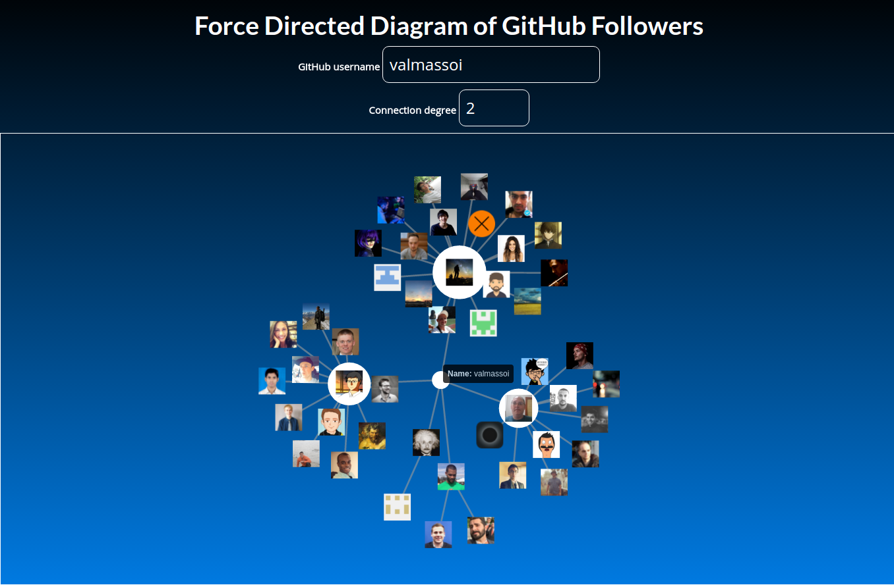

# gh-followers
A coding challenge [prompt](./prompt.md) that visualizes GitHub followers using a `d3.js` force directed graph

## preview


## build, run, and test
```bash
$ git clone https://github.com/valmassoi/gh-followers gh-followers
$ cd gh-followers

# Install dependencies
$ npm install

# Run program

```

## questions
* `"don't worry about n=1000"` is `n = degree || n = nodes`

## tradeoffs
* Angular 2 Observable delay would have been nice but was achieved with lodash debounce  
* note: used ES6 without babel, browser must support  

## ideas
* input for followers or following

## TODO
- [x] You may make unauthenticated requests to GitHub's API, but take care to properly handle hitting the GitHub API rate limit and other exceptions (your UI should clearly explain these errors).  
- [ ] Have some way to test the correctness of the program. You don't need comprehensive unit tests; a basic end-to-end test is fine.  
